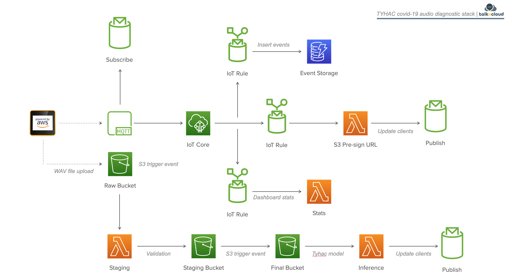

## TYHAC (turn your head and cough)

TYHAC (pronounced *tieack*) is an IoT covid-19 audio diagnostic stack that uses deep learning to determine if an audio cough sample is positive or negative for covid-19.

To my knowledge this is the first publicly available covid-19 audio analysis project that provides access to the trained model, source code for hosting the model and cloud infrastructure to host an end to end solution.

## Buying Mick a coffee

If you enjoyed this project and feel like shouting me a coffee, I'll happily accept but if thats not for you, I'd appreciate if you could please star or share this project for visibility to help others.

## Disclaimer

Not a doctor. No medical professionals have reviewed or worked on this project. Seek medical advice from medical professionals. This is a prototype.

## Intended audience

This project is for builders, thinkers and those who can't stop tinkering. If you're into IoT, ML, AWS and/or tech, then read on. 

I originally created this project to share with the community, it has since been submitted to the [hackster healthy spaces with challenge 2021](https://www.hackster.io/contests/Healthy-Spaces-with-AWS) and has since won runner up.

The hackster write up contains a wealth of information:
Link to [hackster submission](https://www.hackster.io/mick20/tyhac-covid-19-audio-diagnostic-stack-9d5455).

I've since submitted the project to the 2021 Hackaday Prize for [Challenge 5: Reactivate Wildcard](https://hackaday.io/contest/179533-supplyframe-designlab-2021-hackaday-prize/log/192962-challenge-5-reactivate-wildcard) and I've added more information in the build logs which shows more detail on how the project was created.

Link the hackaday write up:
[hackaday reactivate submission](https://hackaday.io/project/182276-tyhac-covid-19-audio-diagnostic-stack)

## High level design

The design uses the M5 Core2 AWS EduKit with AWS IoT Core, S3, DynamoDB and SageMaker. The model source data is pulled from public repositories containing labelled covid-19 audio samples, both positive and negative as well as additional attritibutes that may be useful. Check the source repositories in the aws-sagemaker folder for more details. The audio files are processed and prepared to be consumed by the SageMaker training job, the audio samples are processed into mel-spectrograms on the fly during training thanks to fastai and fastaudio.

Here is a short demo of the device working in action:

The design shows a WAV sample recorded from the device being securely uploaded to S3. This is made possible by using IoT core as the central touch point for all IoT related interactions. DynamoDB has been selected as the event data repoistory, DynamoDB provides a way to extend the use cases into mobile and web apps. The other noteable part of the design is that model hosting is done via Lambda (containers), I chose Lambda to reduce costs and the response times are acceptable.

## Bill of materials

The good part about this build is that you need very few parts and the total cost is around $70 USD

| Item | Quantity | Description | Link |
|--|--|--|--|
| EduKit | x1 | M5 Core2 AWS EduKit | https://shop.m5stack.com/products/m5stack-core2-esp32-iot-development-kit-for-aws-iot-edukit |
| MIC | x1 | LM393 Mic Unit | https://shop.m5stack.com/products/microphone-unit-lm393?_pos=1&_sid=09124710e&_ss=r |
| SD | x1 | 16GB Micro SD card | https://www.officeworks.com.au/shop/officeworks/p/sandisk-ultra-16gb-micro-sdhc-memory-card-sdsq16gb |

## Intended use cases

The core of the solution revolves around two modes:

1.  Passive

    This mode is intended to be used in an office setting such as a cubicle, common area and elevators. The device will actively listen for noises that register and then submit samples for predictions.

2.  Active

    This mode is intended for clinicians as a field unit. The device does not actively listen and does not require the additional LM393 mic sensor unit, the unit can be used on battery for this mode. This gives the ability to submit positive samples to the dataset and also test patients.

## Using this repo

Due to the size and complexity of the project, I have split it up into three distinct sections:

1.  aws-cdk
    this folder contains the [cloud development kit](https://docs.aws.amazon.com/cdk/latest/guide/home.html) infrastructure as code to deploy the AWS cloud services used. This will deploy everything from IoT, DynamoDB and Lambda functions for prediction etc. 

2.  aws-iot
    the adruino code used to run the M5 Core2 EduKit. 

3.  aws-sagemaker
    the juicy notebooks and scripts used to run data preparation, training and inference with sagemaker.

The following sections will give high-level quick start instructions, refer to the folder readme for more info. The source code also provides links to more details where applicable. 

### CDK

I have used [projen](https://github.com/projen/projen) to create the project (great project, check it out). To deploy the stack do the following:

1. npm install -g projen
2. yarn install
3. authenticate to aws using the cli tools either creds, sso or magic
3. projen
3. projen deploy

### IoT

The device code has been developed in arduino, I have used [platform.io](https://platformio.org/) to help develop the project. This is my first real attempt at using platform.io after switching from the arduino ide. It's good, use it.

### Sagemaker

You don't need to deploy anything in sagemaker to run this project. The sagemaker code is not part of CDK, I've supplied the notebooks and code for people to get a feel for how it works in sagemaker and hopefully build on.

model arch & hyperparameters:

| parameter | setting | comments |
|--|--|--|
| architecture | resnet18 | sampled resnet, 34, 50 |
| epochs | 12 | |
| batch-size | 64 |
| optimizer | adam | |
| learning rate | 0.01 | | 

For the deep learning ML fans out there, the model deployed in this project achieves the following:

run: tyhac-fastai-2021-09-15-06-59-58-639

Using the notebooks provided you can have a bit of look into audio properties of covid patients, here is a sample of the data prep splitting the imbalance of the dataset and showing what it looks like:

If you just want to take the model and try some stuff out, the model is located [in the aws-cdk lambda folder](aws-cdk/src/lambda/prediciton). The model was exported using standard fastai saving methods and can be loaded using the same techniques. Refer to the fastai help documentation for further details or refer to the lambda predicition code which shows loading the model.

## Getting Started

You will need to do the following:

1.  Provision the AWS services
    Use the [aws-cdk]('aws-cdk') folder or manually create the services needed

2.  Provision the device in AWS
    Use the [aws-iot]('aws-iot') folder and helper scripts to provision the device or manually provision in AWS.

3.  Load the tyhac firmware onto your M5 Stack Core2 AWS EduKit
    Use the [aws-iot]('aws-iot') and platform.io to compile and upload the firmware to your device

## Costs

To deploy the CDK stack and run this on AWS the approx costs (USD) (monthly) are:

| Item | Quantity | Description | Cost |
|--|--|--|--|
| IoT Core | x1 | IoT Core, Rules, Messages | $0.10 |
| S3 | x3 | Raw, Staging, Final - 1GB | $0.03 |
| DynamoDB | x1 | On-demand - 1GB | $0.25 |
| Lambda | xx | 10 second, 512MB | $0.00 |
| ECR | x1 | Inference, Staging containers | $0.40 |

Total Monthly: ~$0.84

Note: estimates only, refer to AWS for up to date pricing

## Getting help

I am keen to help others in all aspects of this projects or similar where I have capacity to do so. If you need help with this project feel free to raise github tickets and I'll do my best. If you need help building this into a product or similar product where possible, feel free reach out directly. Contact details can be found on my blog https://www.talkncloud.com

## Contributing

Yes please! If you're keen to build on this and share with the community I am keen for others to help out. Please get in touch.

## Author

This project was created by Michael (Mick/Mike) Jacobsson - https://www.talkncloud.com