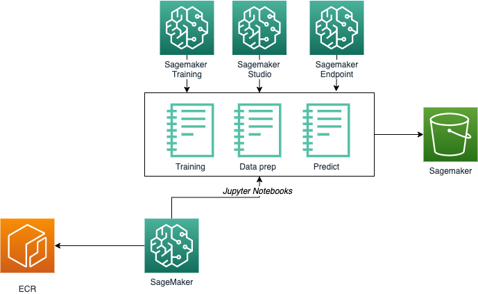

## Welcome to Tyhac Deep learning with AWS Sagemaker
This part of the project is how the data is prepared, trained and hosted with AWS Sagemaker using fastai and fastaudio.

## Notes
Be sure to check out the [notes](NOTES.md) file, I've tried to include all the links to articles and research that helped me out. None of this would be possible with the great work everyone has done before me. 

## Data prep
This was probably the most time consuming part of the process. I must have gone back to the data-prep portion a million times and had to keep tweaking it. The data prep scripts are a combination of work from the following:

* https://github.com/virufy/virufy-covid
* https://c4science.ch/diffusion/10770/repository/master/

Massive shout out to those teams, excellent work!

I have tried to use as much data as possible, you'll notice that my notebook uses the cough-shallow and heavy samples to give us more data. I also create my own combined data of all the samples, I think this was the easiest for the model that I wanted. You might want to combine the other attributes of data to improve training, I know this is something that virufy did. 

Run the dataprep notebook, this will download from the public repos all of the cases we have and combine them into a folder and master data set. The files will be uploaded to your S3 bucket to be used by the training. You shouldn't have to re-run the data-prep. Once the dataset is loaded onto S3 feel free to remove anything left behind as it's quite large. 

Note: I originally had a sagemaker data processing job when I was using tensflow, this is because it generated mel spectrograms and I was training on those. With fastai and fastaudio it's done on the fly, so I didn't feel the need for a dedicated job anymore. I can potentially see a processing job to pull, combine and upload the data to s3, this would make it a bit slower to iterate over though. 

## Containers
Before you can begin training you will need to build your custom containers. Because we are using fastai and fast audio there are no AWS containers at the moment does fastai/fastaudio. Use the docker scripts to build and push a container into your ECR, this will provide the containers you need.

If you intended on using the SageMaker prediction endpoint, also deploy the inference container.

Note: You will need to update your region in the shell script.

Pro-tip: If you have a slow upload use something else e.g. AWS Cloud9 or EC2

## Training
Update the training script with your account details so that it can launch a job with the correct container. Also make adjustments to buckets if needed. 

The training notebook will submit a job to sagemaker, you can watch the progress in CloudWatch.

Note: I am using spot training, depending on your region and availability you might have to adjust as needed.

## Prediction
You can go ahead and use your normal tools to run predictions. If you prefer to deploy the model into a sagemaker endpoint another notebook has been provided which shows you have to deploy and run inference end to end to help speed up the process.

A lambda version of the inference is provided in the aws-cdk folder. This is the endpoint used by the project and the IoT device as its cheaper and met my requirements, also lambda is cool.

## Updating the model
If you do deploy these notebooks with the intention of updating the deployed lambda model in the project. Use cell in the training notebook to sync the model or download from S3. The model will then need to be extracted and copied into the lambda/prediction folder. Replace the exported pickle file in this folder and deploy the project using projen / cdk. Thats it!

## Costs
A note about costs, look, SageMaker is great but costs can get out of hand pretty quickly. Be sure to setup billing alerts and watch your spend. I originally used SageMaker studio and EFS is used with that. Your costs will quickly increase with this and the particular set of notebooks as I pull down the data into the session and then upload into s3. The data prep itself you could run locally if you have the space and compute, once the prep is done you shouldn't have to run it again, which would reduce the storage requirements.

I've designed the training endpoints themselves to use spot and are cheap. The training jobs depending on your parameters take between 25-60 minutes.

## Design

The following gives you a bit of an idea on how things hang together:

